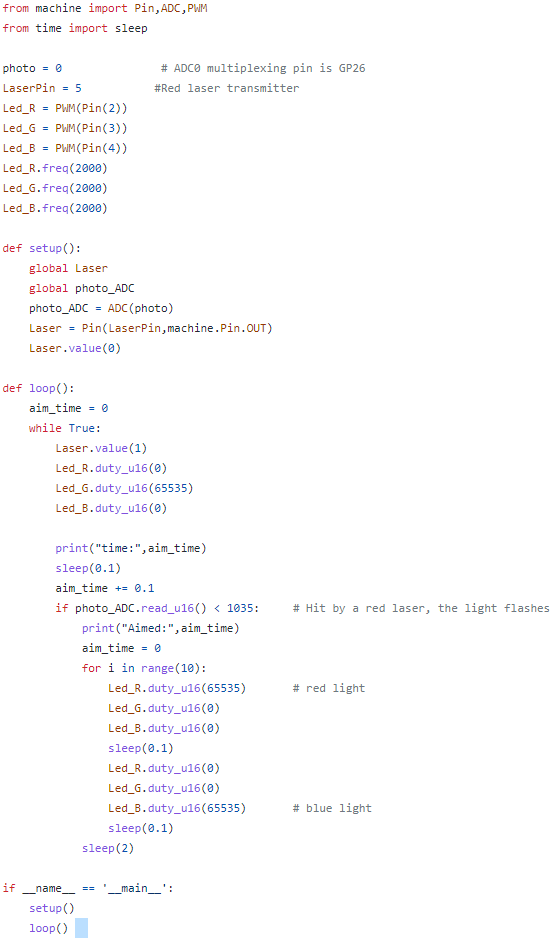
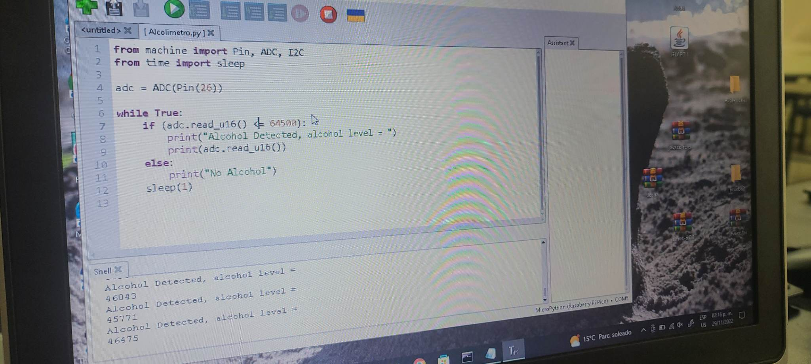
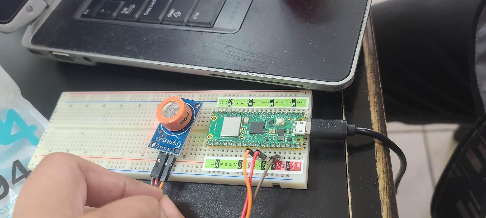

# Caja de 37 sensores
### Sensores utilizados: Sensor RGB, Sensor laser, y el sensor Photosensible.

### Sistemas programables
### Instituto tecnologico de tijuana
- Integrantes del equipo
- Castro Pacheco Jose Manuel
- Benitez Peraza Joshua
- Cruz Eduardo Valadez Melendez
- Garcia Juarez Isai

### Docente
-Rene Solis Reyes

En la siguiente imagen se logra apreciar los componentes del proyecto.

Ahora se mostrara dicho codigo utilizado para hacer el programa:

#Joshua Benitez Peraza
#Castro Pacheco Jose
#El programa requiere y hace uso de los siguientes sensores: Photosensible, RGB, Laser.El codigo siguiente permite hacer uso de los sensores ya mencionados para hacer un detector del laser. Se prende el laser que se debera apuntar al sensor photosensible, de esta manera el led RGB pasara de estar parpadeando azul y rojo, a ver significando que esta recibiendo luz, adicionalmente los parametros, obtenidos por los sensores se estaran imprimiendo en consola.

Por ultimo se tomo sensor extra que detecta alcohol, la cual es un sensor mq3.
Se mostrara el codigo utilizado y el funcionamiento de dicho codigo:
Se hace uso de dicho sensor para medir la cantidad de gas alchol que recibe, para realizar una prueba se utilizo una botella de asetona.
El codigo convierte la señal mandada por el sensor en forma de voltaje, y cuando este sube a mas de una señal en 16 bits de 60000, significa que se detecto alcohol

Por ultimo se muestra como en que si compila dicho programa y detecta el alcohol

