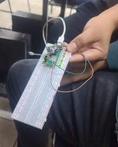
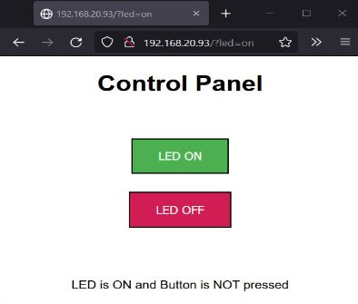

# Caja de 37 sensores
### Sensores utilizados: Sensor RGB, Sensor laser, y el sensor Photosensible.

### Sistemas programables
### Instituto tecnologico de tijuana
- Integrantes del equipo
- Castro Pacheco Jose Manuel
- Benitez Peraza Joshua
- Cruz Eduardo Valadez Melendez
- Garcia Juarez Isai

### Docente
-Rene Solis Reyes

En la siguiente imagen se logra apreciar los componentes del proyecto.

El html sigueinte contiene dos botones, los cuales activan y apagan el sistema, al presionar el boton de encendido se activa el laser y el led RGB comienza a parpadear, hasta que el photosensor reciba la luz, y en ese caso se tornara verde el sersor.

Por ultimo el video demostrando que funciona correctamente se mando por classroom, ya que al momento de ingresar dicho video por aqui se hay bastante complicaciones para poder que este funcione correctamente.
